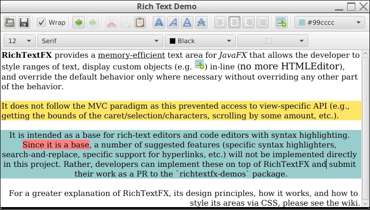
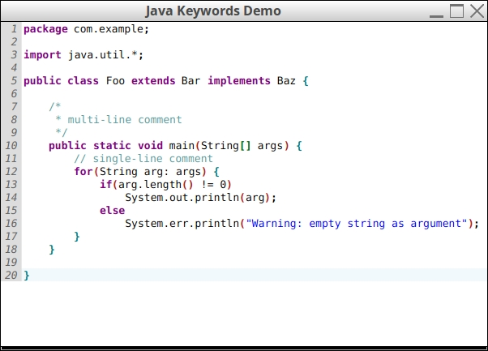
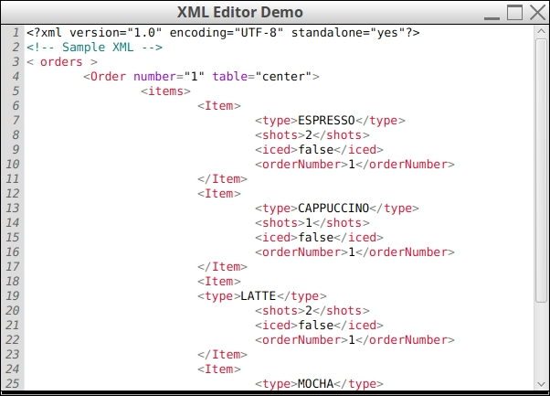
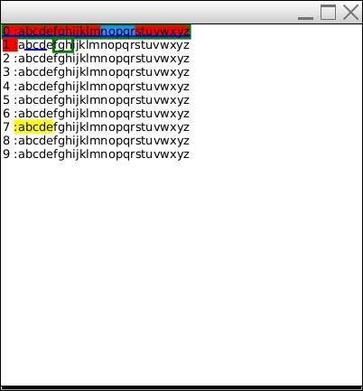
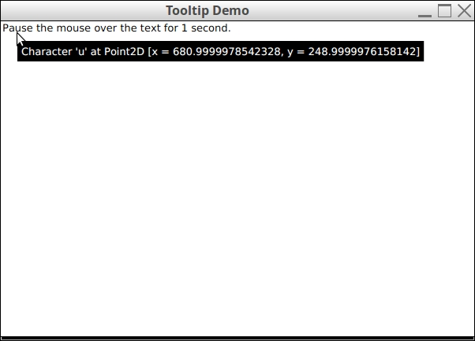

Demos
-----

Note: This page does not show all the demos in the package. Follow the instructions below to see them all.

### Table of Contents

* [Instructions for Running Demos](#instructions-for-running-demos)
* [Structure of the Demos package](#structure-of-the-demos-package)
* Some Demos
  * [Rich-text editor](#rich-text-editor)
  * [Highlighting of Java keywords](#automatic-highlighting-of-java-keywords)
  * [XML Editor](#xml-editor)
  * [Multiple Carets and Selections](#multiple-carets-and-selections)
  * [Custom tooltips](#custom-tooltips)

### Instructions for running demos
## run with this command
`./gradlew run`
### whant to run another demo ?
in `build.gradle` at the bottom of the file
you need to maually add a path to other demo main class !
ex. `mainClassName = 'org.fxmisc.richtext.demo.richtext.RichTextDemo'`

## WARNING: below instructions are not working
1. Clone the repository: `git clone https://www.github.com/FXMisc/RichTextFX.git`
2. Checkout the latest release version: `git checkout v0.9.0`
3. See the list of demos using a gradle task `./gradlew demos`
4. Run a demo using a gradle task: `./gradlew [Demo Name]`

(For Windows users, replace `./gradlew` with `gradlew.bat` in the above commands)

### Structure of the Demos package

- Each runnable demo class that extends `Application` ends in the suffix: "Demo"
- If a demo requires additional classes that should not be nested, the demo and its helper classes appear in their own package named after the demo (e.g. `RichTextDemo` is found in the `richtext` package)

### Rich-text editor

Source Code: [RichTextDemo.java](src/main/java/org/fxmisc/richtext/demo/richtext/RichTextDemo.java)

### Automatic highlighting of Java keywords

Source Code:

[JavaKeywordsDemo.java](src/main/java/org/fxmisc/richtext/demo/JavaKeywordsDemo.java)

[JavaKeywordsAsyncDemo.java](src/main/java/org/fxmisc/richtext/demo/JavaKeywordsAsyncDemo.java)

The former computes highlighting on the JavaFX application thread, while the latter computes highlighting on a background thread.

### XML Editor

Similar to the [Java Keywords](#automatic-highlighting-of-java-keywords) demo above, this demo highlights XML syntax. Courtesy of @cemartins.

Source Code: [XMLEditorDemo.java](src/main/java/org/fxmisc/richtext/demo/XMLEditorDemo.java)

### Multiple Carets and Selections

Source Code: [MultiCaretAndSelectionDemo.java](src/main/java/org/fxmisc/richtext/demo/MultiCaretAndSelectionDemo.java)

### Custom tooltips

When the mouse pauses over the text area, you can get index of the character under the mouse. This allows you to implement, for example, custom tooltips whose content depends on the text under the mouse.

Source Code: [TooltipDemo.java](src/main/java/org/fxmisc/richtext/demo/TooltipDemo.java)

